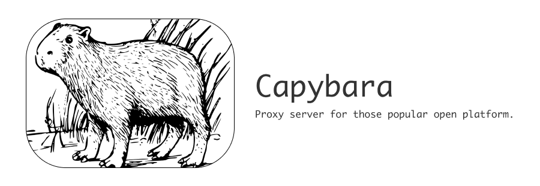

<h1 align="center">
	
</h1>

### About

> Capybara - Proxy server for those popular open platform.

### Motivation

Using or integrating popular open platform services (APIs) in local-first software (e.g. n8n.io) is not an out-of-the-box affair.

While some platforms may have implemented this service calling logic in the platform's built-in connectors, this breaks the local-first principle.

We prefer that these proxy services also run directly locally, so that sensitive data and information such as the configuration of these proxy services is also available to the user, and Capybara is built for this purpose.

I will also use Capybara as one of the built-in integration components for some of the local-first software I'm developing.

"Why can't I just use these open platform SDKs?"

This is because popular local-first software is generally aimed at end-users rather than developers, so it's not possible to integrate and use these SDKs directly in such software, and because the advantage of using a standalone-mode local proxy service is that you can easily see what's going on, Capybara will provide a GUI interface and configuration management, which will greatly reduce the barrier to use, and is designed to ensure that the end-user experience.

### Support List

* [ ] Dingtalk
* [ ] Wechat
